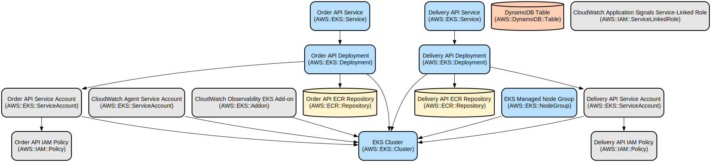

# Java-based Microservices Application with AWS Infrastructure Automation

A containerized Java microservices application demonstrating order processing and delivery management with automated AWS infrastructure deployment, monitoring, and load testing capabilities.

This project implements a scalable microservices architecture using Spring Boot with two main services: Order API and Delivery API. The application leverages AWS services including EKS for container orchestration, DynamoDB for data persistence, ECR for container registry, and CloudWatch for monitoring and observability. The entire infrastructure is automated through shell scripts, making it easy to deploy, test, and clean up resources.

The application features automated deployment to AWS EKS, integrated monitoring with CloudWatch, IAM role-based security, and a load testing framework. It demonstrates best practices for cloud-native applications including containerization, infrastructure as code, and observability.

## Repository Structure
```
.
├── delivery-api/                 # Delivery service implementation
│   ├── Dockerfile               # Container image definition for delivery service
│   ├── pom.xml                  # Maven configuration for delivery service
│   └── src/                     # Source code for delivery service
├── order-api/                   # Order service implementation
│   ├── Dockerfile              # Container image definition for order service
│   ├── pom.xml                 # Maven configuration for order service
│   └── src/                    # Source code for order service
├── scripts/                    # Infrastructure automation scripts
│   ├── 1-create-env.sh        # Creates EKS cluster and required AWS resources
│   ├── 2-build-deploy-app.sh  # Builds and deploys applications to EKS
│   ├── 3-setup-cloudwatch-agent.sh  # Configures CloudWatch monitoring
│   ├── 4-annotate-wokloads.sh # Configures OpenTelemetry instrumentation
│   ├── 5-generate-load.sh     # Load testing utility
│   ├── 6-build-cleanup.sh     # Removes application resources
│   ├── 7-cleanup-env.sh       # Removes all created AWS resources
│   └── traffic-generator/     # Load testing components
│       ├── deployment.yaml    # Kubernetes deployment configuration
│       ├── Dockerfile        # Container image definition for load generator
│       └── traffic-generator.sh  # Load generation script
└── pom.xml                    # Parent Maven configuration
```

## Usage Instructions
### Prerequisites
- AWS CLI configured with appropriate credentials
- kubectl installed and configured
- eksctl installed
- Docker installed and running
- jq command-line JSON processor
- Maven 3.6+ 
- Java 21
- AWS account with permissions to create:
  - EKS clusters
  - DynamoDB tables
  - IAM roles and policies
  - ECR repositories
  - CloudWatch resources

### Installation

1. Clone the repository:
```bash
git clone <repository-url>
cd <repository-directory>
```

2. Create the AWS infrastructure:
```bash
./scripts/1-create-env.sh --region us-east-2
```

3. Build and deploy the application:
```bash
./scripts/2-build-deploy-app.sh
```

4. Set up CloudWatch monitoring:
```bash
./scripts/3-setup-cloudwatch-agent.sh
```

5. Enable OpenTelemetry instrumentation:
```bash
./scripts/4-annotate-wokloads.sh
```

6. Generate test load:
```bash
./scripts/5-generate-load.sh
```

7. To clean up the application (keeping infrastructure):
```bash
./scripts/6-build-cleanup.sh
```

8. To remove all AWS infrastructure:
```bash
./scripts/7-cleanup-env.sh --region us-east-2
```

Note: Scripts should be run in the order shown above. The cleanup scripts (6 and 7) should only be run when you want to remove resources.

### Quick Start
1. After deployment, get the service endpoints:
```bash
kubectl get svc
```

2. Test the Order API:
```bash
curl -X POST http://<order-api-endpoint>/api/orders \
  -H "Content-Type: application/json" \
  -d '{
    "orderId": "123",
    "customerName": "John Doe",
    "items": [{
      "productId": "456",
      "quantity": 1,
      "price": 29.99
    }],
    "totalAmount": 29.99,
    "shippingAddress": "123 Main St"
  }'
```

### More Detailed Examples
1. Remove the load generator:
```bash
# Remove only traffic generator to stop increasing dynamodb table size
./scripts/6-build-cleanup.sh --traffic-only
```

### Troubleshooting
1. Pod startup issues:
```bash
kubectl describe pod <pod-name>
kubectl logs <pod-name>
```

2. Service connectivity issues:
```bash
# Check service endpoints
kubectl get endpoints

# Check service logs
kubectl logs -l app=java-order-api
kubectl logs -l app=java-delivery-api
```

3. DynamoDB access issues:
- Verify IAM role assignments:
```bash
kubectl describe serviceaccount <service-account-name>
```
- Check CloudWatch logs for permissions errors

## Data Flow
The application processes orders through a two-service architecture where the Order API receives orders and forwards them to the Delivery API for fulfillment and storage in DynamoDB.

```ascii
[Client] -> [Order API] -> [Delivery API] -> [DynamoDB]
   |            |              |                |
   |            |              |                |
   +------------+--------------+----------------+
          CloudWatch Monitoring & Logging
```

Component interactions:
1. Client sends order request to Order API
2. Order API validates and forwards request to Delivery API
3. Delivery API processes order and stores in DynamoDB
4. Both services use IAM roles for AWS service access
5. CloudWatch monitors all components and collects metrics
6. Load balancer distributes traffic across service replicas
7. Service mesh handles inter-service communication

## Infrastructure



The infrastructure consists of the following components:

- EKS Cluster:
  - Managed node group with t3.large instances
  - VPC-CNI, CoreDNS, and kube-proxy addons
  - EKS version 1.33

- DynamoDB:
  - Table: orders-catalog
  - Partition key: Id (String)
  - Provisioned capacity: 1 RCU, 1 WCU

- IAM:
  - Service accounts for Order and Delivery APIs
  - Policies for DynamoDB access
  - CloudWatch agent role
  - CloudWatch Application Signals Service-Linked Role

- Container Registry:
  - ECR repositories for Order and Delivery APIs
  - ECR repository for traffic generator

- CloudWatch:
  - Container Insights enabled
  - Application Signals configured
  - Fluent Bit for container logs
  - CloudWatch Observability EKS Add-on

- Kubernetes Resources:
  - Order API Deployment and Service (LoadBalancer)
  - Delivery API Deployment and Service (ClusterIP)
  - Traffic Generator Deployment
  - CloudWatch Agent Service Account