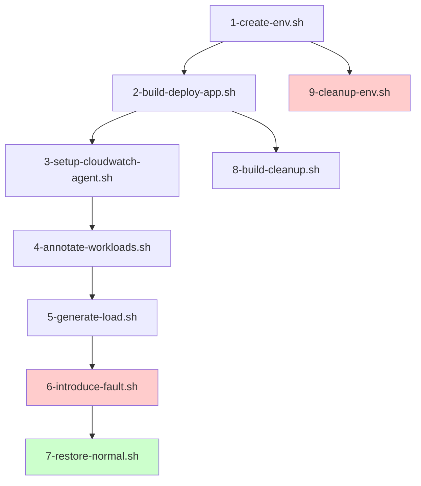

# Python Sample Application - CloudWatch Application Signals

A containerized Python microservices application demonstrating AWS CloudWatch Application Signals with FastAPI and Flask frameworks. This sample showcases synchronous order processing using direct HTTP communication between services and MySQL on AWS RDS for persistent storage, with automated AWS infrastructure deployment, monitoring, and observability.

## Architecture Overview

This project implements a simplified, cloud-native microservices architecture using Python with two main services:
- **Order API**: FastAPI-based service for order creation and direct HTTP communication
- **Delivery API**: Flask-based REST service for order processing and MySQL storage

The application leverages AWS services including EKS for container orchestration, RDS MySQL for relational data persistence, ECR for container registry, and CloudWatch Application Signals for comprehensive observability with automatic instrumentation across direct service-to-service communication.

## Prerequisites

- AWS CLI configured with appropriate credentials
- kubectl installed and configured
- eksctl installed
- Docker installed and running
- jq command-line JSON processor
- Python 3.12 or later (for local development)
- pip package manager
- MySQL client (for local testing and verification)
- AWS account with permissions to create:
  - EKS clusters
  - RDS MySQL instances
  - VPC, subnets, and security groups
  - IAM roles and policies
  - ECR repositories
  - CloudWatch resources

## Quick Start

### 1. Navigate to Python Sample
```bash
cd python-sample-app
```

### 2. Deploy Infrastructure
```bash
./scripts/1-create-env.sh --region us-east-2
```

### 3. Build and Deploy Application
```bash
./scripts/2-build-deploy-app.sh
```

### 4. Configure Monitoring
```bash
./scripts/3-setup-cloudwatch-agent.sh
./scripts/4-annotate-workloads.sh
```

### 5. Generate Test Traffic
```bash
./scripts/5-generate-load.sh
```

### 6. Fault Injection (Optional)
```bash
# Inject database connection pool fault for demonstration
./scripts/6-introduce-fault.sh

# Restore normal operation
./scripts/7-restore-normal.sh
```

### 7. View in CloudWatch
- Navigate to CloudWatch Console
- Go to Application Signals
- Explore service maps, metrics, and traces

## Script Reference

The sample includes a complete set of automation scripts for deployment, testing, and cleanup:

| Script | Purpose | Description |
|--------|---------|-------------|
| `1-create-env.sh` | **Environment Setup** | Creates EKS cluster, RDS MySQL, IAM roles, and SSM parameters |
| `2-build-deploy-app.sh` | **Application Deployment** | Builds Docker images and deploys to Kubernetes |
| `3-setup-cloudwatch-agent.sh` | **Monitoring Setup** | Configures CloudWatch Application Signals |
| `4-annotate-workloads.sh` | **Observability** | Adds annotations for service discovery |
| `5-generate-load.sh` | **Load Testing** | Generates synthetic traffic for testing |
| `6-introduce-fault.sh` | **Fault Injection** | Injects database connection pool exhaustion fault |
| `7-restore-normal.sh` | **Fault Recovery** | Restores normal database configuration |
| `8-build-cleanup.sh` | **App Cleanup** | Removes application deployments (keeps infrastructure) |
| `9-cleanup-env.sh` | **Full Cleanup** | Removes all AWS resources including SSM parameters |

### Script Dependencies



## Testing Direct Order Processing

After deployment, test the direct order processing flow:

### 1. Test Order Creation (Direct HTTP Communication)

```bash
# Get service endpoint
kubectl get svc python-order-api

# Create an order (processes directly through Delivery API)
curl -X POST http://<order-api-endpoint>/api/orders \
  -H "Content-Type: application/json" \
  -d '{
    "order_id": "123",
    "customer_name": "John Doe",
    "items": [{
      "product_id": "456",
      "quantity": 1,
      "price": 29.99
    }],
    "total_amount": 29.99,
    "shipping_address": "123 Main St"
  }'

# Expected response: 200 OK (order processed successfully)
```

### 2. Verify Direct Service Communication

```bash
# Monitor Order API logs for HTTP calls to Delivery API
kubectl logs -f -l app=python-order-api

# Monitor Delivery API logs for direct request processing
kubectl logs -f -l app=python-delivery-api
```

### 3. Verify MySQL Data Storage

```bash
# Get RDS endpoint
aws rds describe-db-instances --db-instance-identifier python-orders-db --query 'DBInstances[0].Endpoint.Address' --output text

# Connect to MySQL and verify order storage
mysql -h <rds-endpoint> -u admin -p orders_db
# Password will be retrieved from AWS Secrets Manager during deployment

# Query stored orders
SELECT * FROM orders WHERE order_id = '123';
```

### 4. Health Check Endpoints

```bash
# Check Order API health
curl http://<order-api-endpoint>/api/orders/health

# Check Delivery API health (REST service)
kubectl port-forward deployment/python-delivery-api 5000:5000
curl http://localhost:5000/api/delivery/health
```

## Python Framework Features

This sample demonstrates CloudWatch Application Signals integration with:

### FastAPI (Order API)
- **Async/Await Support**: High-performance async request handling
- **Automatic OpenAPI Documentation**: Interactive API docs at `/docs`
- **Pydantic Validation**: Type-safe request/response models
- **Dependency Injection**: Clean configuration management
- **Auto-instrumentation**: OpenTelemetry FastAPI integration

### Flask (Delivery API)
- **Traditional WSGI**: Proven web framework patterns
- **Blueprint Organization**: Modular application structure
- **Request Context**: Thread-local request handling
- **Flexible Configuration**: Environment-based settings
- **Auto-instrumentation**: OpenTelemetry Flask integration

## CloudWatch Application Signals Features

This sample demonstrates:

- **Automatic Service Discovery**: Services are automatically detected and mapped
- **Distributed Tracing**: Request flows tracked across Order API → Delivery API → RDS MySQL
- **Synchronous Processing Observability**: HTTP service-to-service communication metrics and traces
- **Database Performance Monitoring**: MySQL query performance, connection pool usage, and transaction metrics
- **Performance Metrics**: Latency, error rates, and throughput automatically collected
- **Service Level Objectives (SLOs)**: Define and monitor application performance targets
- **Anomaly Detection**: Automatic identification of performance deviations
- **Custom Metrics**: Application-specific business metrics
- **Multi-Framework Support**: Observability across FastAPI and Flask with automatic instrumentation

## Data Flow

```
[Client] → [Order API (FastAPI)] → [Delivery API (Flask)] → [RDS MySQL]
    ↓              ↓                        ↓                      ↓
    └──────────────── CloudWatch Application Signals ──────────────┘
```

### Direct Processing Benefits

- **Simplified Architecture**: Direct service-to-service communication reduces complexity
- **Immediate Response**: Synchronous processing provides immediate feedback to clients
- **Easier Debugging**: Direct call stack makes troubleshooting more straightforward
- **Observability**: Full visibility into HTTP service communication and database operations

## Infrastructure Components

- **EKS Cluster**: Managed Kubernetes with t3.large nodes
- **RDS MySQL**: `python-orders-db` for relational data storage with Multi-AZ deployment
- **VPC & Security Groups**: Network isolation and secure RDS access from EKS
- **ECR Repositories**: Container images for both Python services
- **IAM Roles**: Service accounts with RDS and SSM permissions
- **SSM Parameter Store**: Dynamic configuration for database connection pooling
- **CloudWatch**: Application Signals, Container Insights, and logging
- **Load Balancer**: External access to Order API
- **ClusterIP Service**: Internal communication between Order API and Delivery API

## Environment Variables

### Order API Configuration
- `DELIVERY_API_URL`: Delivery API service URL for direct HTTP communication
- `AWS_REGION`: AWS region for RDS operations
- `LOG_LEVEL`: Logging level (INFO, DEBUG, WARNING, ERROR)
- `OTEL_SERVICE_NAME`: Service name for OpenTelemetry tracing
- `OTEL_RESOURCE_ATTRIBUTES`: Additional service metadata for tracing

### Delivery API Configuration
- `MYSQL_HOST`: RDS MySQL endpoint hostname
- `MYSQL_PORT`: MySQL port (default: 3306)
- `MYSQL_DATABASE`: Database name (orders_db)
- `MYSQL_USER`: Database username
- `MYSQL_PASSWORD`: Database password (from AWS Secrets Manager)
- `AWS_REGION`: AWS region for RDS operations
- `LOG_LEVEL`: Logging level (INFO, DEBUG, WARNING, ERROR)
- `OTEL_SERVICE_NAME`: Service name for OpenTelemetry tracing
- `OTEL_RESOURCE_ATTRIBUTES`: Additional service metadata for tracing

### Dynamic Configuration (SSM Parameter Store)
- `/python-sample-app/mysql/pool-size`: MySQL connection pool size (default: 10)
- `/python-sample-app/mysql/max-overflow`: MySQL connection pool max overflow (default: 20)

These parameters are read at application startup and can be modified for fault injection without code changes.

### Automatic OpenTelemetry Configuration
- `OTEL_PYTHON_LOGGING_AUTO_INSTRUMENTATION_ENABLED`: Enable automatic log correlation
- `OTEL_EXPORTER_OTLP_ENDPOINT`: CloudWatch Application Signals endpoint
- `OTEL_PROPAGATORS`: Trace context propagation format

## Fault Injection for Demonstrations

This sample includes built-in fault injection capabilities to demonstrate how CloudWatch Application Signals helps identify and troubleshoot issues in microservices architectures.

### Database Connection Pool Exhaustion

The application includes a configurable database connection pool fault that can be injected for demonstration purposes:

#### **Inject Fault:**
```bash
./scripts/6-introduce-fault.sh
```

This script will:
- Reduce MySQL connection pool size to 1 connection
- Set max overflow to 0 connections  
- Restart delivery API pods to apply changes
- Verify fault injection via health endpoint

#### **Expected Impact:**
- **Increased Latency**: Requests queue waiting for database connections
- **Connection Timeouts**: Under concurrent load, requests may timeout
- **Cascading Failures**: Delivery API issues propagate to Order API
- **Observable Degradation**: Clear performance impact visible in CloudWatch Application Signals

#### **Restore Normal Operation:**
```bash
./scripts/7-restore-normal.sh
```

This script will:
- Restore pool size to 10 connections
- Restore max overflow to 20 connections
- Restart delivery API pods
- Verify normal operation restored

### Configuration Management

The fault injection system uses AWS SSM Parameter Store for dynamic configuration:

- **Parameters Created:**
  - `/python-sample-app/mysql/pool-size` (default: 10)
  - `/python-sample-app/mysql/max-overflow` (default: 20)

- **Manual Configuration:**
```bash
# View current values
aws ssm get-parameters --names "/python-sample-app/mysql/pool-size" "/python-sample-app/mysql/max-overflow"

# Inject fault manually
aws ssm put-parameter --name "/python-sample-app/mysql/pool-size" --value "1" --overwrite
aws ssm put-parameter --name "/python-sample-app/mysql/max-overflow" --value "0" --overwrite
kubectl rollout restart deployment/python-delivery-api

# Restore normal operation manually  
aws ssm put-parameter --name "/python-sample-app/mysql/pool-size" --value "10" --overwrite
aws ssm put-parameter --name "/python-sample-app/mysql/max-overflow" --value "20" --overwrite
kubectl rollout restart deployment/python-delivery-api
```

## Cleanup

From the `python-sample-app` directory:

Remove application resources (keep infrastructure):
```bash
./scripts/8-build-cleanup.sh
```

Remove all AWS resources (including SSM parameters):
```bash
./scripts/9-cleanup-env.sh --region us-east-2
```


---

**Back to**: [Main Repository](../README.md)